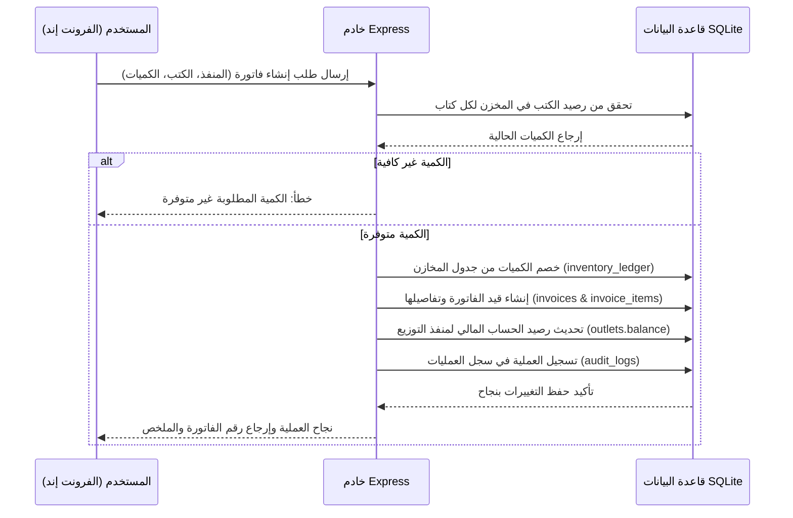

# مطبعة حمزة — نظام إدارة المنصة الموحد

مرحباً بك في الدليل الشامل والاحترافي لنظام إدارة **مطبعة حمزة**. هذا الملف يحتوي على التوثيق الفني الكامل للباك إند والفرونت إند، آلية العمل، تدفقات البيانات، ومواقع الدوال، وإرشادات النشر الكاملة على سيرفر Hostinger VPS باللغة العربية.

---

## 📌 فهرس المحتويات
- [1. نظرة عامة والتقنيات المستخدمة](#1-نظرة-عامة-والتقنيات-المستخدمة)
- [2. هيكلية المجلدات الرئيسية](#2-هيكلية-المجلدات-الرئيسية)
- [3. تفاصيل الدوال والمسؤوليات البرمجية](#3-تفاصيل-الدوال-والمسؤوليات-البرمجية)
- [4. هيكل الصلاحيات والأدوار (RBAC)](#4-هيكل-الصلاحيات-والأدوار-rbac)
- [5. تدفق البيانات والعمليات الأساسية (Data Flows)](#5-تدفق-البيانات-والعمليات-الأساسية-data-flows)
- [6. آلية العمل للنسخ الاحتياطي التلقائي (2:00 صباحاً)](#6-آلية-العمل-للنسخ-الاحتياطي-التلقائي-200-صباحا)
- [7. تهيئة وإعداد التقارير وتصدير XLSX/PDF/CSV](#7-تهيئة-وإعداد-التقارير-تصدير-xlsxpdfcsv)
- [8. دليل النشر الفعلي على سيرفر Hostinger VPS](#8-دليل-النشر-الفعلي-على-سيرفر-hostinger-vps)
- [9. دليل تحديثات الكود عبر GitHub على الـ VPS](#9-دليل-تحديثات-الكود-عبر-github-على-ال-vps)
- [10. استكشاف الأخطاء وإصلاحها (Troubleshooting)](#10-استكشاف-الأخطاء-وإصلاحها-troubleshooting)

---

## 1. نظرة عامة والتقنيات المستخدمة
يعمل النظام كبنية موحدة (Node.js Monolith) لضمان سهولة الإدارة والأداء الفائق والاستقرار على سيرفرات VPS:
* **الباك إند (Backend):** مبني بـ Express.js، ويقدم خادم API متين على المسار `/api/*` مع حماية متكاملة للجلسات (Sessions).
* **الفرونت إند (Frontend):** مبني بـ React.js + Material UI (MUI) مع دعم كامل للغة العربية والاتجاه من اليمين لليسار (RTL)، ويتم بناؤه وتخزينه في مجلد `public` ليقوم سيرفر Express بتقديمه للزوار تلقائياً.
* **قاعدة البيانات (Database):** تعتمد على SQLite محفوظة بالكامل في المجلد المعزول `storage/` لحمايتها من الوصول المباشر من الخارج ولتسهيل النسخ والترقية.

[⬆️ العودة للفهرس](#📌-فهرس-المحتويات)

---

## 2. هيكلية المجلدات الرئيسية
```txt
├── app.js                          # نقطة الانطلاق الرئيسية لخادم Express
├── package.json                    # إعدادات الاعتماديات والمهام الخاصة بالتشغيل
├── .env.example                    # نموذج لملف الإعدادات البيئية للمنصة
├── scripts/                        # سكربتات المهام الخاصة بالبناء والنسخ الاحتياطي
│   └── backup-db.js                # أداة تشغيل النسخ الاحتياطي اليدوي لقاعدة البيانات
├── public/                         # المجلد العام للملفات الثابتة ومخرجات بناء React
├── storage/                        # المجلد المعزول لقاعدة البيانات، النسخ الاحتياطية، المرفقات
│   ├── database.sqlite             # قاعدة البيانات الفعلية النشطة للمنصة
│   ├── backups/                    # ملفات النسخ الاحتياطي الزمنية المستخرجة
│   ├── uploads/                    # الملفات والمستندات المرفوعة بالنظام
│   └── exports/                    # التقارير المؤقتة المستخرجة
├── server/                         # كود الباك إند بالكامل
│   ├── config/                     # إعدادات الاتصال وحماية المسارات
│   ├── db/                         # تعريف الجداول والـ migrations وبذور البيانات (seeds)
│   ├── middleware/                 # برمجيات الوسيطة (الأمان، التحقق، تسجيل العمليات)
│   └── modules/                    # الوحدات الوظيفية للنظام (auth, products, invoices, etc.)
└── client/                         # كود الفرونت إند بالكامل (React)
    ├── index.html                  # ملف القالب الرئيسي للواجهة
    ├── vite.config.js              # إعدادات البناء والـ proxy للواجهة الأمامية
    ├── src/
        ├── main.jsx                # نقطة البداية وتشغيل React
        ├── App.jsx                 # تعريف التوجيه والمسارات المحمية
        ├── styles/                 # ملفات التنسيق CSS المنظمة للمنصة بالكامل
        ├── layouts/                # إطار الواجهة الموحد والقوائم
        └── pages/                  # الصفحات المستقلة للوحدات البرمجية
```

[⬆️ العودة للفهرس](#📌-فهرس-المحتويات)

---

## 3. تفاصيل الدوال والمسؤوليات البرمجية

### أ. إدارة الجلسات والمصادقة (Auth & Sessions)
* **المسار بالباك إند:** `server/modules/auth/`
  * [authRoutes.js](file:///d:/Projects/BookStore%20Manager/Book-Store-Public/server/modules/auth/authRoutes.js): تعريف مسارات تسجيل الدخول، تسجيل الخروج، والتحقق من حالة الجلسة النشطة.
  * [authService.js](file:///d:/Projects/BookStore%20Manager/Book-Store-Public/server/modules/auth/authService.js): التحقق من صحة كلمة المرور باستخدام `bcrypt` واستخراج بيانات صلاحيات المستخدم وأدواره وتمريرها في الجلسة `req.session.user`.
* **المسار بالفرونت إند:** `client/src/app/AuthContext.jsx` (إدارة حالة تسجيل الدخول محلياً ومشاركة الجلسة مع كافة المكونات).

### ب. إدارة الكتب والمنتجات (Products & Catalog)
* **المسار بالباك إند:** `server/modules/products/`
  * [productsRoutes.js](file:///d:/Projects/BookStore%20Manager/Book-Store-Public/server/modules/products/productsRoutes.js): مسارات الإضافة والتعديل والحذف والبحث للكتب.
  * [productPricesRoutes.js](file:///d:/Projects/BookStore%20Manager/Book-Store-Public/server/modules/products/productPricesRoutes.js): إدارة مصفوفة تسعير الكتب المختلفة حسب نوع وفئة منفذ التوزيع الشريك.
* **المسار بالفرونت إند:** `client/src/pages/Products.jsx` (كتالوج الكتب) و `client/src/pages/Categories.jsx` (إدارة التصنيفات).

### ج. دورة الفواتير والمبيعات (Invoices & Sales)
* **المسار بالباك إند:** `server/modules/invoices/`
  * [invoicesRoutes.js](file:///d:/Projects/BookStore%20Manager/Book-Store-Public/server/modules/invoices/invoicesRoutes.js): معالجة طلبات الفواتير والتحقق من توفر الكميات بالمخازن وتحديث أرصدة العملاء ومنافذ التوزيع مالياً.
  * [invoicesService.js](file:///d:/Projects/BookStore%20Manager/Book-Store-Public/server/modules/invoices/invoicesService.js): حسابات الضرائب، الخصومات، والكميات الإجمالية.
  * [pdfService.js](file:///d:/Projects/BookStore%20Manager/Book-Store-Public/server/modules/invoices/pdfService.js): استخدام مكتبة `html-pdf-node` لإنتاج فواتير طباعة PDF احترافية موحدة للعملاء.
* **المسار بالفرونت إند:** `client/src/pages/Invoices.jsx` (إدارة الفواتير، الاستعراض، الطباعة، والإضافة).

### د. مرتجعات مبيعات الموظفين (Returns & Employees)
* **المسار بالباك إند:** `server/modules/returns/`
  * [returnsRoutes.js](file:///d:/Projects/BookStore%20Manager/Book-Store-Public/server/modules/returns/returnsRoutes.js): مسار معالجة المرتجعات. عند تأكيد مرتجع، يتم إعادة كميات الكتب إلى المخزن وتعديل رصيد العميل أو الموظف وإضافة قيد مالي في الخزنة تلقائياً.
  * **ملاحظة الأجور والرواتب:** لا تحتوي الرواتب والأجور على تحديد "منفذ توزيع شريك" لأنها مخصصة لموظفي المطبعة كافة، وتتم إدارتها في الحسابات العامة للمطبعة.
* **المسار بالفرونت إند:** `client/src/pages/Returns.jsx` (استعراض وإضافة المرتجعات).

### هـ. النسخ الاحتياطي المحمي بكلمة مرور (Secure Backups)
* **المسار بالباك إند:** `server/modules/admin/`
  * [adminRoutes.js](file:///d:/Projects/BookStore%20Manager/Book-Store-Public/server/modules/admin/adminRoutes.js): مسار التحقق من كلمة مرور المدير قبل الدخول واستعراض جدول النسخ الاحتياطية وإنشاء نسخة احتياطية جديدة أو استعادة نسخة سابقة.
* **المسار بالفرونت إند:** `client/src/pages/Backups.jsx` (شاشة قفل الحماية، طلب كلمة المرور، جدول النسخ، وأزرار التحكم).

[⬆️ العودة للفهرس](#📌-فهرس-المحتويات)

---

## 4. هيكل الصلاحيات والأدوار (RBAC)
تتم إدارة صلاحيات المستخدمين بدقة وأمان كامل عبر البرمجية الوسيطة `rbac.js` بملف `server/middleware/rbac.js`.
يتم تهيئة وتخزين الأدوار والصلاحيات في قاعدة البيانات عبر البذرة [dev_seed.js](file:///d:/Projects/BookStore%20Manager/Book-Store-Public/server/db/seeds/dev_seed.js) وتوزيعها كالتالي:

1. **super_admin (مدير النظام الكلي):** يمتلك كافة صلاحيات النظام بدون استثناء بما فيها إدارة الموظفين، النسخ الاحتياطي، المبيعات والمالية.
2. **admin (مدير عمليات):** يمتلك صلاحيات إدارة الكتالوج، المبيعات، الشحن والمالية بالكامل.
3. **accountant (المحاسب المالي):** صلاحيات مخصصة للمدفوعات، الفواتير، الحسابات الختامية وكشوفات الحسابات فقط.
4. **inventory_manager (أمين المخزن):** إدارة توريد وتعديل المخزون، استلام الشحنات، وإدارة تفاصيل الكتب المادية.
5. **sales_staff (موظف مبيعات):** إنشاء الفواتير وإثبات الدفعات النقدية.
6. **shipping_user (مسؤول الشحن واللوجستيات):** استعراض الشحنات وتعديل حالات التسليم.
7. **readonly_viewer (مراقب مالي):** استعراض التقارير دون إمكانية التعديل أو الحذف.

[⬆️ العودة للفهرس](#📌-فهرس-المحتويات)

---

## 5. تدفق البيانات والعمليات الأساسية (Data Flows)

### تدفق عملية الفوترة والمخزون (Invoicing Flow):


[⬆️ العودة للفهرس](#📌-فهرس-المحتويات)

---

## 6. آلية العمل للنسخ الاحتياطي التلقائي (2:00 صباحاً)
يحتوي النظام على مجدول داخلي آمن وتلقائي تماماً يعمل في الخلفية بمجرد تشغيل خادم Express بالباك إند:
* **الملف المسؤول:** [backupScheduler.js](file:///d:/Projects/BookStore%20Manager/Book-Store-Public/server/modules/admin/backupScheduler.js).
* **آلية العمل:** يقوم المجدول بفحص الوقت المحلي للسيرفر كل 30 ثانية.
* **التوقيت:** عند بلوغ الساعة **2:00 صباحاً** تماماً، يقوم المجدول بالتحقق من عدم تكرار عملية النسخ لهذا اليوم، ثم ينسخ ملف قاعدة البيانات النشط `database.sqlite` ويحفظ نسخة مضغوطة زمنياً في مجلد الحفظ المعزول `storage/backups/backup_YYYY-MM-DD-HH-MM-SS.sqlite`.
* **مستوى الأمان:** العملية تتم داخلياً على مستوى نظام التشغيل دون الحاجة إلى أدوات جدولة خارجية (كـ Cron Jobs في VPS) مما يضمن سهولة ترحيل وتشغيل التطبيق على أي بيئة بشكل فوري.

[⬆️ العودة للفهرس](#📌-فهرس-المحتويات)

---

## 7. تهيئة وإعداد التقارير وتصدير XLSX/PDF/CSV
يوفر النظام مركز تصدير متطور وذكي جداً في ملف [exportsService.js](file:///d:/Projects/BookStore%20Manager/Book-Store-Public/server/modules/exports/exportsService.js) ويوفر ثلاثة تنسيقات احترافية:

1. **تنسيق Excel (.xlsx):**
   * يتم إنشاؤه وتنسيقه باستخدام مكتبة `exceljs` مع تفعيل خاصية الاتجاه من اليمين لليسار (`rightToLeft: true`).
   * تلوين ترويسة الجداول باللون الأزرق الداكن الاحترافي وتلوين أسطر الجدول بنظام الخطوط المتبادلة (Zebra Striping).
   * ضبط هوامش وعرض الأعمدة تلقائياً بناءً على محتواها لإعطاء مظهر متناسق وجذاب.
   * دمج الخلايا وإظهار الإجمالي الكلي للبيانات في أخر سطر مع رسم خطين أسفل المجموع (Double Border) كما في الأنظمة المحاسبية العالمية.
2. **تنسيق PDF (.pdf):**
   * يتم استخراجه كملف تقرير طباعة منسّق ومنظم بالكامل باستخدام مكتبة `html-pdf-node`.
   * ترويسة الجداول وجميع الخلايا بها بوردرات كاملة واضحة ومحددة.
   * يدعم كامل التنسيقات وتوسيط النصوص والخطوط المحاسبية وجداول ملونة.
3. **تنسيق CSV (.csv):**
   * تصدير قياسي سريع وبسيط يدعم ترميز UTF-8 وبادئة BOM ليعمل بشكل فوري باللغة العربية دون أي مشاكل في خلايا Excel.

[⬆️ العودة للفهرس](#📌-فهرس-المحتويات)

---

## 8. دليل النشر الفعلي على سيرفر Hostinger VPS

لتشغيل المنصة على خادم VPS جديد يعمل بنظام Ubuntu (وهو النظام القياسي لسيرفرات Hostinger):

### الخطوة 1: تثبيت الحزم الأساسية على السيرفر
اتصل بالسيرفر عبر SSH ونفذ الأوامر التالية لتحديث النظام وتثبيت خادم Node.js وقاعدة بيانات SQLite:
```bash
sudo apt update && sudo apt upgrade -y
# تثبيت Node.js (الإصدار 18 أو 20)
curl -fsSL https://deb.nodesource.com/setup_20.x | sudo -E bash -
sudo apt install -y nodejs sqlite3 build-essential
```

### الخطوة 2: إعداد المشروع وملف الإعدادات الموحد `.env`
1. اسحب المشروع من مستودع GitHub الخاص بك إلى السيرفر في مجلد `/var/www/hamza-press/`.
2. قم بإنشاء ملف `.env` موحد في المجلد الرئيسي للمشروع:
   ```bash
   cp .env.example .env
   nano .env
   ```
3. قم بتعديل القيم المهمة داخل ملف `.env`:
   * اجعل `NODE_ENV=production` لضمان حماية المنصة وتشغيلها في وضع الإنتاج الفعلي.
   * ضع كلمة مرور قوية جداً للمدير ورقم منفذ مناسب (مثال `PORT=3000`).
   * قم بتوليد مفتاح أمان عشوائي طويل لـ `SESSION_SECRET` لتأمين جلسات المستخدمين.

### الخطوة 3: تثبيت الاعتماديات وبناء المشروع
نفذ الأوامر التالية لتثبيت الحزم للباك إند والفرونت إند وبناء الواجهة بالكامل:
```bash
# تثبيت حزم الباك إند
npm install
# تثبيت حزم الفرونت إند وبناؤه
npm install --prefix client
npm run build
```

### الخطوة 4: تهيئة وبناء قاعدة البيانات
قم بتهيئة قاعدة البيانات الجديدة النشطة وزرع الجداول والبيانات الأساسية الافتراضية:
```bash
npm run db:reset
```
*سيقوم هذا الأمر بإنشاء ملف قاعدة البيانات النشط بداخل المجلد الآمن `storage/database.sqlite` وتجهيز الحساب الافتراضي للمدير العام.*

### الخطوة 5: إدارة التشغيل عبر PM2
يفضل استخدام أداة `PM2` لإدارة تشغيل خادم Node.js وضمان بقائه نشطاً في الخلفية دائماً وإعادة تشغيله تلقائياً في حال توقف السيرفر أو حدوث أي مشكلة:
```bash
sudo npm install -g pm2
# تشغيل خادم المنصة
pm2 start app.js --name "hamza-press"
# حفظ حالة تشغيل PM2 لتبدأ مع إقلاع النظام
pm2 save
pm2 startup
```

### الخطوة 6: إعداد خادم Nginx لعرض المنصة برابط آمن
لتمرير الطلبات من المنفذين `80/443` إلى خادم التطبيق الداخلي (المنفذ `3000`):
1. ثبت خادم Nginx:
   ```bash
   sudo apt install nginx -y
   ```
2. قم بإنشاء ملف إعدادات جديد للموقع:
   ```bash
   sudo nano /etc/nginx/sites-available/hamza-press
   ```
3. أضف الإعدادات التالية (مع استبدال `yourdomain.com` بنطاقك أو آي بي السيرفر):
   ```nginx
   server {
       listen 80;
       server_name yourdomain.com;

       location / {
           proxy_pass http://localhost:3000;
           proxy_http_version 1.1;
           proxy_set_header Upgrade $http_upgrade;
           proxy_set_header Connection 'upgrade';
           proxy_set_header Host $host;
           proxy_cache_bypass $http_upgrade;
       }
   }
   ```
4. قم بتفعيل الموقع وإعادة تشغيل Nginx:
   ```bash
   sudo ln -s /etc/nginx/sites-available/hamza-press /etc/nginx/sites-enabled/
   sudo systemctl restart nginx
   ```
5. لتفعيل شهادة الحماية SSL المجانية (اختياري ولكنه هام لإنتاج الفواتير):
   ```bash
   sudo apt install certbot python3-certbot-nginx -y
   sudo certbot --nginx -d yourdomain.com
   ```

[⬆️ العودة للفهرس](#📌-فهرس-المحتويات)

---

## 9. دليل تحديثات الكود عبر GitHub على الـ VPS
واحدة من أهم مميزات هيكلة المشروع هي فصل كود التطبيق عن قاعدة البيانات تماماً (قاعدة البيانات والنسخ الاحتياطية متواجدة داخل مجلد `storage/` المهمل بالكامل في مستودع الجيت `.gitignore`).
لتحديث المنصة مستقبلاً دون التأثير على بياناتك:

1. اتصل بالسيرفر عبر SSH واذهب لمجلد المشروع:
   ```bash
   cd /var/www/hamza-press/
   ```
2. اسحب التحديثات الجديدة من مستودع GitHub الخاص بك مباشرة:
   ```bash
   git pull origin main
   ```
3. ثبّت أي حزم برمجية جديدة قد تكون تمت إضافتها:
   ```bash
   npm install
   npm install --prefix client
   ```
4. أعد بناء الواجهة لتحديث الملفات الثابتة في مجلد `public/`:
   ```bash
   npm run build
   ```
5. شغل الـ Migrations لتحديث الجداول دون حذف البيانات الحالية:
   ```bash
   npm run db:migrate
   ```
6. أعد تشغيل التطبيق في PM2 لتفعيل التحديثات:
   ```bash
   pm2 restart hamza-press
   ```
*بهذه الطريقة، تظل قاعدة البيانات `database.sqlite` والملفات المرفوعة للعملاء آمنة ومحفوظة بنسبة 100% دون أي مساس بها.*

[⬆️ العودة للفهرس](#📌-فهرس-المحتويات)

---

## 10. استكشاف الأخطاء وإصلاحها (Troubleshooting)

### المشكلة: ظهور رسالة "Client build is pending" عند فتح الموقع
* **السبب:** لم يتم بناء فرونت إند React بعد، أو مخرجات بناء الفرونت إند غير موجودة في المجلد الرئيسي `public/`.
* **الحل:** اذهب لمجلد المشروع ونفذ `npm run build` للتأكد من بناء الفرونت إند ونقله إلى مجلد البابليك العام بشكل صحيح.

### المشكلة: خطأ "SESSION_SECRET is required in production environment"
* **السبب:** المنصة تعمل في وضع الإنتاج (`NODE_ENV=production`) ولكن لم يتم تعيين قيمة سرية للجلسات بملف `.env`.
* **الحل:** افتح ملف `.env` وقم بتعيين قيمة عشوائية طويلة للمتغير `SESSION_SECRET` ثم أعد تشغيل السيرفر.

### المشكلة: عدم إمكانية رفع الملفات أو ظهور خطأ أثناء الرفع
* **السبب:** قد لا يملك خادم Node.js صلاحية الكتابة وإنشاء الملفات داخل المجلد `storage/uploads`.
* **الحل:** قم بإعطاء الصلاحيات الكاملة لمجلد التخزين بداخل الخادم:
  ```bash
  sudo chown -R $USER:$USER /var/www/hamza-press/storage
  chmod -R 775 /var/www/hamza-press/storage
  ```

[⬆️ العودة للفهرس](#📌-فهرس-المحتويات)
