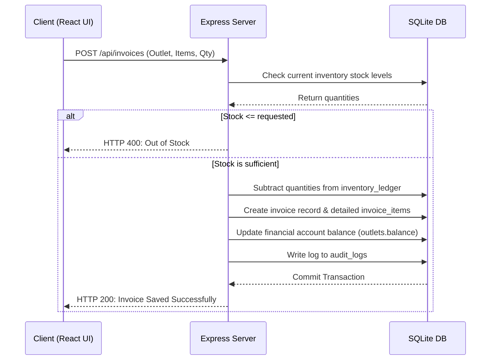

# Hamza Printing Press — Unified Management System (Vite React + Express)

Welcome to the comprehensive, professional technical documentation for the **Hamza Printing Press** Management System. This document serves as the guide for backend/frontend structures, business workflows, code directories, and detailed production deployment instructions on Hostinger VPS.

---

## 📌 Table of Contents
- [1. System Architecture & Tech Stack](#1-system-architecture--tech-stack)
- [2. Directory Structure](#2-directory-structure)
- [3. Feature Map & Code Locations](#3-feature-map--code-locations)
- [4. Role-Based Access Control (RBAC)](#4-role-based-access-control-rbac)
- [5. Core Workflows & Data Flows](#5-core-workflows--data-flows)
- [6. Automated 2:00 AM Database Backups](#6-automated-200-am-database-backups)
- [7. Excel & PDF Styled Exports System](#7-excel--pdf-styled-exports-system)
- [8. Hostinger VPS Production Deploy Guide](#8-hostinger-vps-production-deploy-guide)
- [9. Seamless Code Updates via GitHub](#9-seamless-code-updates-via-github)
- [10. Production Troubleshooting FAQ](#10-production-troubleshooting-faq)

---

## 1. System Architecture & Tech Stack
The platform is designed as a unified Node.js Monolith, optimized for direct host deployments:
* **Backend:** Express.js app serving routes under `/api/*` backed by robust session validation.
* **Frontend:** Vite-powered React.js + Material UI (MUI) compiled into the static `public` directory.
* **Database:** SQLite engine running inside `storage/` folder, completely decoupled from root codebase updates.

[⬆️ Back to Index](#📌-table-of-contents)

---

## 2. Directory Structure
```txt
├── app.js                          # Express.js main entry file
├── package.json                    # Package metadata & script commands
├── .env.example                    # Template environment configuration file
├── scripts/                        # Automation helper scripts
│   └── backup-db.js                # Manual DB backup tool
├── public/                         # Output destination for frontend build files
├── storage/                        # Decoupled storage folder (git ignored)
│   ├── database.sqlite             # Active production SQLite file
│   ├── backups/                    # Chronological database backups
│   ├── uploads/                    # Persisted file attachments
│   └── exports/                    # Temp file export outputs
├── server/                         # Backend source code
│   ├── config/                     # Configuration files & DB bootstrap
│   ├── db/                         # Migration and seed scripts
│   ├── middleware/                 # Security, auditing and role middleware
│   └── modules/                    # Domain-driven features (invoices, auth, etc.)
└── client/                         # Frontend React source code
```

[⬆️ Back to Index](#📌-table-of-contents)

---

## 3. Feature Map & Code Locations

### A. Authentication & Session Validation
* **Backend Path:** `server/modules/auth/`
  * [authRoutes.js](file:///d:/Projects/BookStore%20Manager/Book-Store-Public/server/modules/auth/authRoutes.js): Session login/logout endpoints.
  * [authService.js](file:///d:/Projects/BookStore%20Manager/Book-Store-Public/server/modules/auth/authService.js): Verify hashes via `bcrypt`, load user roles/permissions.
* **Frontend Path:** `client/src/app/AuthContext.jsx` (Global Context provider for logged-in user state).

### B. Catalog & Books Management
* **Backend Path:** `server/modules/products/`
  * [productsRoutes.js](file:///d:/Projects/BookStore%20Manager/Book-Store-Public/server/modules/products/productsRoutes.js): Core catalog REST routes.
  * [productPricesRoutes.js](file:///d:/Projects/BookStore%20Manager/Book-Store-Public/server/modules/products/productPricesRoutes.js): Custom product price matrix based on Outlet Type.
* **Frontend Path:** [Products.jsx](file:///d:/Projects/BookStore%20Manager/Book-Store-Public/client/src/pages/Products.jsx) (Product catalog page).

### C. Invoices & Sales Tracking
* **Backend Path:** `server/modules/invoices/`
  * [invoicesRoutes.js](file:///d:/Projects/BookStore%20Manager/Book-Store-Public/server/modules/invoices/invoicesRoutes.js): Purchase orders & warehouse inventory subtraction.
  * [pdfService.js](file:///d:/Projects/BookStore%20Manager/Book-Store-Public/server/modules/invoices/pdfService.js): Unified invoice PDF generator using `html-pdf-node`.
* **Frontend Path:** [Invoices.jsx](file:///d:/Projects/BookStore%20Manager/Book-Store-Public/client/src/pages/Invoices.jsx) (Sales invoices layout).

### E. Returns & Employee Salaries
* **Backend Path:** `server/modules/returns/`
  * [returnsRoutes.js](file:///d:/Projects/BookStore%20Manager/Book-Store-Public/server/modules/returns/returnsRoutes.js): Restores inventory quantities and creates refund records in treasury logs.
  * **Note on Salaries & Wages:** Salary payouts do not require selecting an outlet since they are registered locally for employee payroll, managed globally under general overhead.
* **Frontend Path:** [Returns.jsx](file:///d:/Projects/BookStore%20Manager/Book-Store-Public/client/src/pages/Returns.jsx) (Inventory return records page).

### F. Password-Protected Admin Tools & Backups
* **Backend Path:** `server/modules/admin/`
  * [adminRoutes.js](file:///d:/Projects/BookStore%20Manager/Book-Store-Public/server/modules/admin/adminRoutes.js): Password verification endpoint & SQLite backup restoration handlers.
* **Frontend Path:** [Backups.jsx](file:///d:/Projects/BookStore%20Manager/Book-Store-Public/client/src/pages/Backups.jsx) (Backup logs interface protected by admin lock-screen).

[⬆️ Back to Index](#📌-table-of-contents)

---

## 4. Role-Based Access Control (RBAC)
Role checks are enforced globally in route handlers via the security middleware [rbac.js](file:///d:/Projects/BookStore%20Manager/Book-Store-Public/server/middleware/rbac.js). 
All roles and their default permission mappings are seeded inside [dev_seed.js](file:///d:/Projects/BookStore%20Manager/Book-Store-Public/server/db/seeds/dev_seed.js):
1. **super_admin:** Total permissions across all actions.
2. **admin:** Operational access except core configurations.
3. **accountant:** Payments, financial statements, invoicing, and reports.
4. **inventory_manager:** Stock ledger entries, stock receipt logs, catalog updates.
5. **sales_staff:** Invoicing creation & cash payment records.
6. **shipping_user:** Delivery logging & courier logistics.
7. **readonly_viewer:** General audit capabilities.

[⬆️ Back to Index](#📌-table-of-contents)

---

## 5. Core Workflows & Data Flows

### Invoicing & Warehouse Subtraction Flow:


[⬆️ Back to Index](#📌-table-of-contents)

---

## 6. Automated 2:00 AM Database Backups
A built-in lightweight backup scheduler is integrated inside the backend server stack:
* **Source Path:** [backupScheduler.js](file:///d:/Projects/BookStore%20Manager/Book-Store-Public/server/modules/admin/backupScheduler.js).
* **Workflow:** The scheduler runs an evaluation loop every 30 seconds.
* **Trigger:** Exactly at **2:00 AM local system time**, it triggers a database copy operation of the active `database.sqlite` file into a timestamped file located in `storage/backups/`. It keeps track of the calendar date to guarantee only one auto-backup executes per day.
* **VPS Advantage:** Runs entirely in Node.js runtime process, meaning zero reliance on external OS-level cron setups.

[⬆️ Back to Index](#📌-table-of-contents)

---

## 7. Excel & PDF Styled Exports System
A high-performance export utility is implemented in [exportsService.js](file:///d:/Projects/BookStore%20Manager/Book-Store-Public/server/modules/exports/exportsService.js) supporting three formats:

1. **Excel format (.xlsx):**
   * Uses `exceljs` with `rightToLeft: true` enabled.
   * Features dark-blue header cells, light slate borders, and automatic alternating zebra striping.
   * Automatic column auto-fit layout adjustment based on text lengths.
   * Bottom double-border summary row for financials.
2. **PDF format (.pdf):**
   * Generated dynamically via `html-pdf-node` with professional print styles.
   * Full borders, custom typography (Cairo), centered text, and localized currency formatting.
3. **CSV format (.csv):**
   * Fast raw UTF-8 export prefixed with a BOM mark to open immediately in Excel in Arabic.

[⬆️ Back to Index](#📌-table-of-contents)

---

## 8. Hostinger VPS Production Deploy Guide

To deploy the app on a clean Ubuntu VPS instance:

### Step 1: Install System Prerequisites
Connect via SSH and install Node.js, SQLite3, and compilation tools:
```bash
sudo apt update && sudo apt upgrade -y
curl -fsSL https://deb.nodesource.com/setup_20.x | sudo -E bash -
sudo apt install -y nodejs sqlite3 build-essential
```

### Step 2: Configure Environment `.env`
1. Clone the repository into `/var/www/hamza-press/`.
2. Create the production `.env` file at the root:
   ```bash
   cp .env.example .env
   nano .env
   ```
3. Set production flags:
   * `NODE_ENV=production`
   * `SESSION_SECRET=a_very_long_secure_random_key`
   * `PORT=3000`

### Step 3: Install Packages & Compile Frontend
```bash
npm install
npm install --prefix client
npm run build
```

### Step 4: Setup SQLite Database
Seeding default tables and default super admin configurations:
```bash
npm run db:reset
```

### Step 5: Process Daemonizing with PM2
To keep the server script alive in the background:
```bash
sudo npm install -g pm2
pm2 start app.js --name "hamza-press"
pm2 save
pm2 startup
```

### Step 6: Reverse Proxy Configuration (Nginx)
Install Nginx and forward external HTTP traffic (port 80/443) to port 3000:
```bash
sudo apt install nginx -y
sudo nano /etc/nginx/sites-available/hamza-press
```
Add Nginx server block:
```nginx
server {
    listen 80;
    server_name yourdomain.com;

    location / {
        proxy_pass http://localhost:3000;
        proxy_http_version 1.1;
        proxy_set_header Upgrade $http_upgrade;
        proxy_set_header Host $host;
    }
}
```
Enable the site configuration and reload Nginx:
```bash
sudo ln -s /etc/nginx/sites-available/hamza-press /etc/nginx/sites-enabled/
sudo systemctl restart nginx
```

[⬆️ Back to Index](#📌-table-of-contents)

---

## 9. Seamless Code Updates via GitHub
Because the database and persistent files live inside the decoupled `./storage/` folder (completely ignored by Git), you can push updates to GitHub and pull them to production seamlessly:
```bash
cd /var/www/hamza-press/
git pull origin main
npm install
npm install --prefix client
npm run build
npm run db:migrate
pm2 restart hamza-press
```
*Your SQLite database `database.sqlite`, customer uploads, and historic backups will remain completely untouched and preserved during this process.*

[⬆️ Back to Index](#📌-table-of-contents)

---

## 10. Production Troubleshooting FAQ

### Q: Opening the domain shows "Client build is pending"
* **Reason:** Vite React compilation was skipped or failed.
* **Fix:** Run `npm run build` in the repository root folder to build frontend files.

### Q: File uploads yield error or file saving failed
* **Reason:** File system permission issue. Node process lacks write access to storage subdirectories.
* **Fix:** Update permissions:
  ```bash
  sudo chown -R $USER:$USER /var/www/hamza-press/storage
  chmod -R 775 /var/www/hamza-press/storage
  ```

[⬆️ Back to Index](#📌-table-of-contents)
